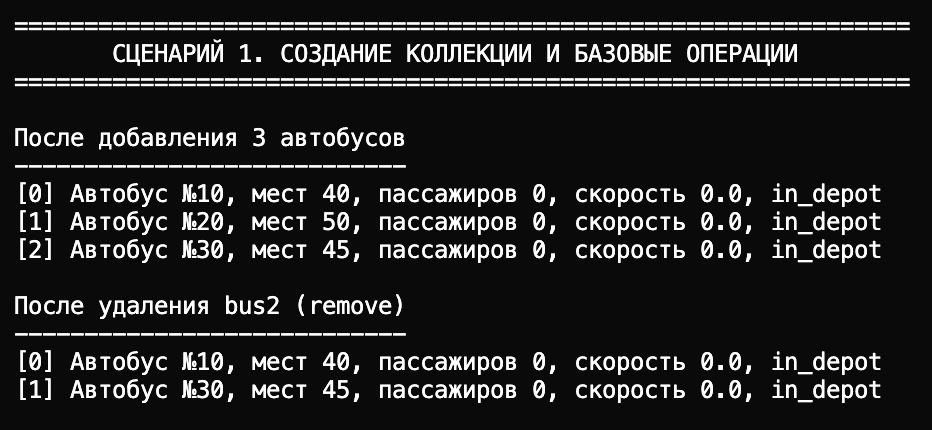
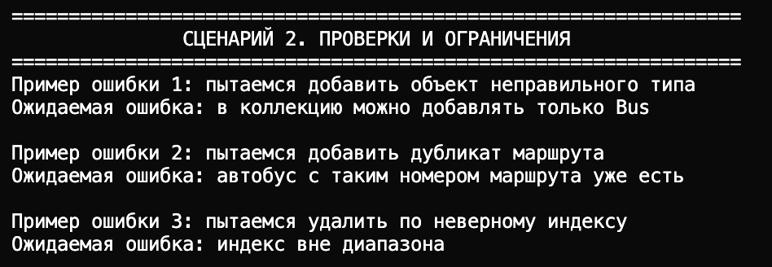
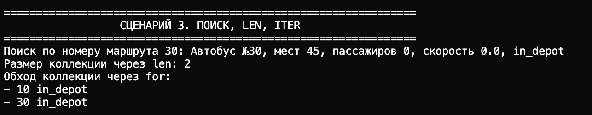
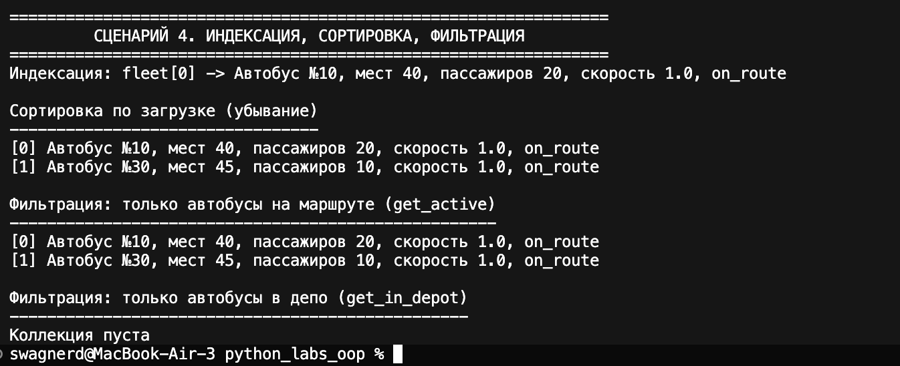
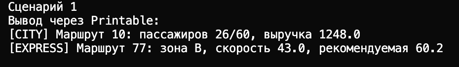
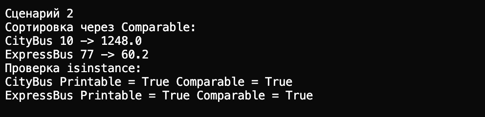
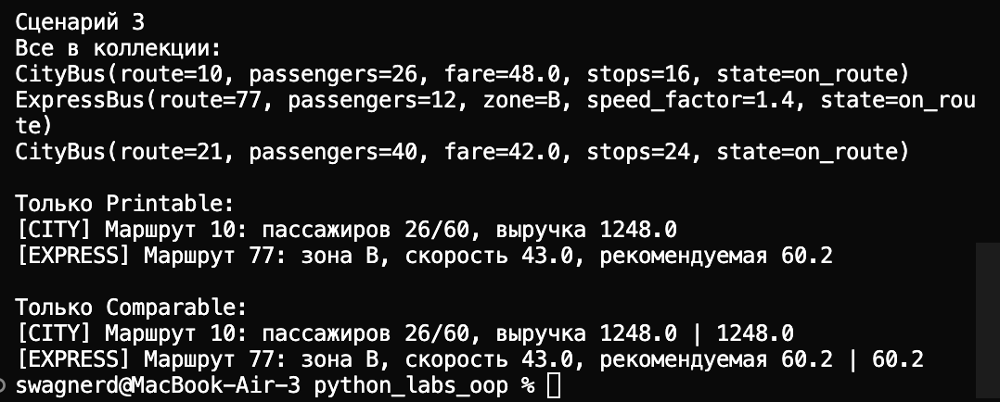

# ЛР 1
# «Умный» автобус на маршруте, который:

- Сам следит за корректностью данных (валидация номера маршрута, вместимости, скорости, пассажиров)
- Запрещает недопустимые операции (скорость в депо, посадка на ТО, высадка не на маршруте, отправка на ТО с пассажирами)
- Предоставляет удобный интерфейс через свойства (@property)

# Реализованный класс Bus

**Закрытые поля:**

- `_route_number` — номер маршрута
- `_capacity` — вместимость 
- `_current_speed` — текущая скорость
- `_passenger_count` — количество пассажиров
- `_state` — статус: `in_depot` / `on_route` / `maintenance`

**Свойства @property:**

- Чтение: `route_number` — номер маршрута
- Чтение: `capacity` — вместимость
- Чтение: `passenger_count` — количество пассажиров
- Чтение: `state` — статус автобуса
- Чтение и запись: `current_speed` — скорость (с проверкой состояния и диапазона)

**Методы:**

- `__str__` — print (читаемое описание)
- `__repr__` — для умных
- `__eq__` — сравнение

**Методы изменения состояния:**

- `start_route()` — выехать на маршрут
- `return_to_depot()` — вернуться в депо
- `send_to_maintenance()` — отправить на Тех. О
- `repair_complete()` — завершить Тех. О

**Бизнес-методы:**

- `board_passengers(count)` — посадить пассажиров (с учётом вместимости и статуса)
- `alight_passengers(count)` — высадить пассажиров (только на маршруте)
- `free_seats()` — количество свободных мест
- `load_factor()` — загрузка в процентах

---

### Создание автобуса 

- Создание автобуса с номером маршрута и вместимостью
- Вывод через `print(bus)` — читаемое описание (номер, места, пассажиры, скорость, состояние)
- Вывод через `repr(bus)` — компактное представление для отладки

Показывает, что объект создаётся с проверкой данных и выводится через методы

### Ошибки 

- Некорректный тип номера маршрута (строка вместо числа)
- Номер маршрута вне диапазона (0)
- Пассажиров больше вместимости

### Сравнение 

- Сравнение двух автобусов с одинаковыми параметрами — `True`
- Сравнение с разным числом пассажиров — `False`
- Демонстрируется работа `__eq__`

### Операции с пассажирами 

### Свойства (геттер/сеттер)

- Установка скорости на маршруте — успешно
- Попытка установить скорость выше `MAX_SPEED` — ошибка
- В депо попытка изменить скорость — ошибка («в депо скорость 0»)

Демонстрируется работа свойства `current_speed` с валидацией и учётом состояния

### Посадка и ограничения по вместимости

- Посадка 30 пассажиров — успешно
- Попытка посадить 100 при вместимости 50 — садятся только до заполнения

Показать, что бизнес-метод `board_passengers` ограничивает число по пассажирам и не даёт превысить вместимость

### Изменение состояний

- Начальное состояние — в депо
- `start_route()` — на маршруте
- Установка скорости, высадка пассажиров, возврат в депо
- `send_to_maintenance()` — на ТО
- Попытка `start_route()` с ТО — ошибка
- `repair_complete()` — снова в депо

Прослеживается смена состояний и запрет недопустимых переходов

### Ограничения по состоянию

- Высадка в депо — ошибка (высадка только на маршруте)
- Отправка на ТО с пассажирами — ошибка (сначала высадить)

Показать, что операции зависят от текущего статуса автобуса

### Расчётные бизнес-методы

- `free_seats()` — количество свободных мест
- `load_factor()` — загрузка в процентах

Демонстрация расчётных методов по данным автобуса.

# ЛР 2 

Для Лр 2  добавлен контейнер `BusCollection`, который хранит объекты `Bus` из Лр 1

## Файлы

- `src/lab02/model.py` — импорт модели `Bus` из Лр 1 
- `src/lab02/collection.py` — класс коллекции `BusCollection`
- `src/lab02/demo.py` — демонстрация сценариев работы коллекции
- `images/lab02/` — изображения к Лр 2 

## Что реализовано 
- Базовые операции:
  - `add(item)`, `remove(item)`, `get_all()`
  - проверка типа (добавлять можно только `Bus`)
- Поиск:
  - `find_by_route_number(route_number)`
  - `find_by_state(state)`
- Поддержка контейнера:
  - `__len__()` -> `len(collection)`
  - `__iter__()` -> `for bus in collection`
  - `__getitem__()` -> `collection[index]`
- Дополнительные операции:
  - `remove_at(index)` — удаление по индексу
  - `sort_by_load(reverse=True)` и универсальный `sort(key, reverse=False)`
- Ограничение при добавлении:
  - запрещён дубликат по номеру маршрута
- Логические фильтры (возвращают новую коллекцию):
  - `get_active()`
  - `get_in_depot()`
  - `get_maintenance()`

## Создание коллекции и базовые операции 

## Проверка ограничений

## Поиск, len, iter 

## Индексация, сортровка, фильтрация 

# ЛР 3

## 1. Цель работы

- Освоить наследование классов в Python
- Построить иерархию объектов на базе кода ЛР-1
- Понять разницу между базовым и производными классами
- Показать полиморфизм и переопределение методов
- Интегрировать иерархию с коллекцией из ЛР-2

## 2. Реализованная иерархия классов

Базовый класс:
- `BusBase` (наследуется от `Bus` из ЛР-1 и вводит общий интерфейс `calculate()`)

Дочерние классы:
- `CityBus`
  - новые атрибуты: `fare`, `stop_count`
  - новый метод: `open_doors()`
  - полиморфный метод: `calculate()` (выручка за рейс)
  - переопределение: `__str__`
- `ExpressBus`
  - новые атрибуты: `zone`, `speed_factor`
  - новый метод: `skip_stop()`
  - полиморфный метод: `calculate()` (рекомендуемая скорость)
  - переопределение: `__str__`

## 3. Демонстрация работы

1. Создание объектов разных типов (`CityBus`, `ExpressBus`), вызов методов базового и дочерних классов
2. Полиморфизм: вызов одного метода `calculate()` у разных объектов с разным результатом, проверка типов через `isinstance()`
3. Интеграция с `BusCollection` (ЛР-2): единая коллекция разных наследников, индексация, сортировка, фильтрация по типу через `filter_by_type(...)` 

## 4. Вывод

В ЛР-3 закреплены:
- наследование и переиспользование кода;
- переопределение методов;
- полиморфизм без `if type == ...` (единый вызов `obj.calculate()`);
- работа иерархии классов через общий контейнер

# Создание базовой иерархии 

# Один метод - разное поведение (полиформизм)

# Интеграция с колекцией из ЛР-2 

# ЛР 4

## 1. Цель работы

- познакомиться с абстрактными базовыми классами (`ABC`);
- ввести интерфейсы как контракт поведения;
- закрепить полиморфизм через единый интерфейс;
- интегрировать интерфейсный подход с коллекцией из ЛР-2.

## 2. Интерфейсы

В `src/lab04/interfaces.py` реализованы:

- `Printable` с обязательным методом `to_string()`;
- `Comparable` с обязательным методом `compare_value()`.

## 3. Реализация в классах

В `src/lab04/models.py` интерфейсы реализуют:

- `CityBus`;
- `ExpressBus`.

Оба класса реализуют оба интерфейса, но с разным поведением:
- `to_string()` формирует разный формат вывода;
- `compare_value()` использует разные бизнес-метрики.

## 4. Демонстрация

В `src/lab04/demo.py` показаны:

1. единый вызов методов интерфейса у разных классов;
2. универсальные функции через интерфейсы + `isinstance`;
3. фильтрация коллекции по интерфейсам (`get_printable`, `get_comparable`).

