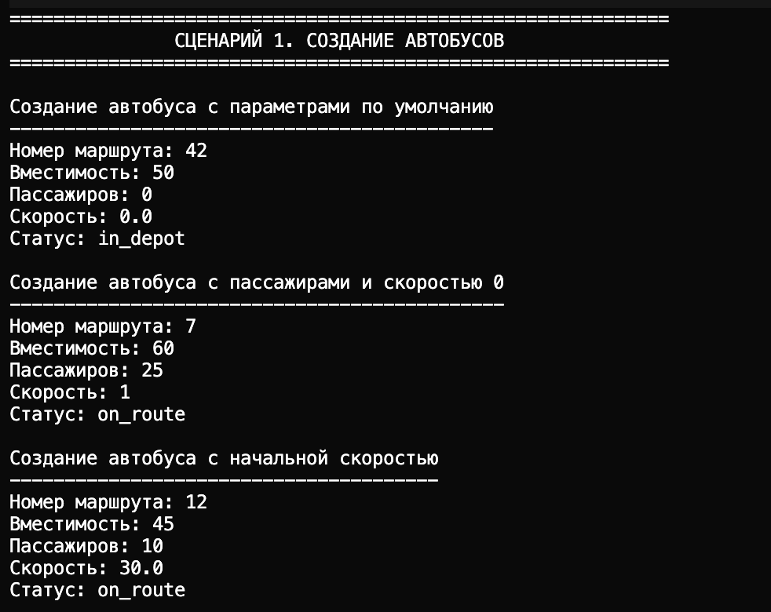
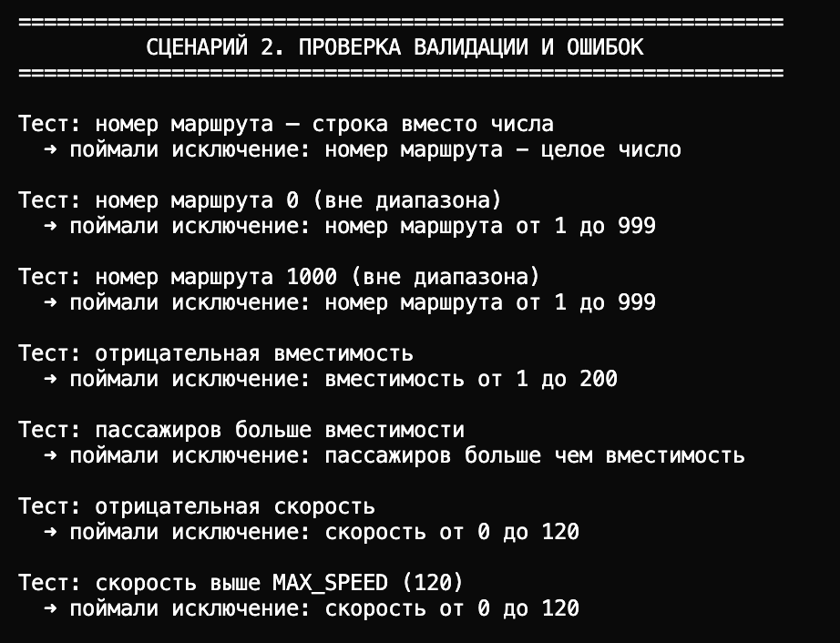
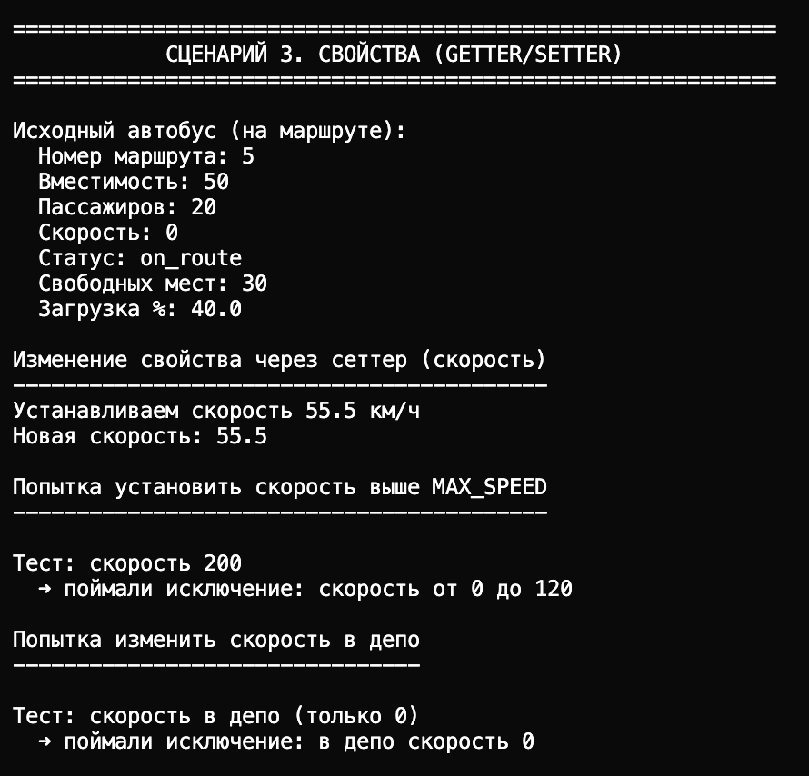
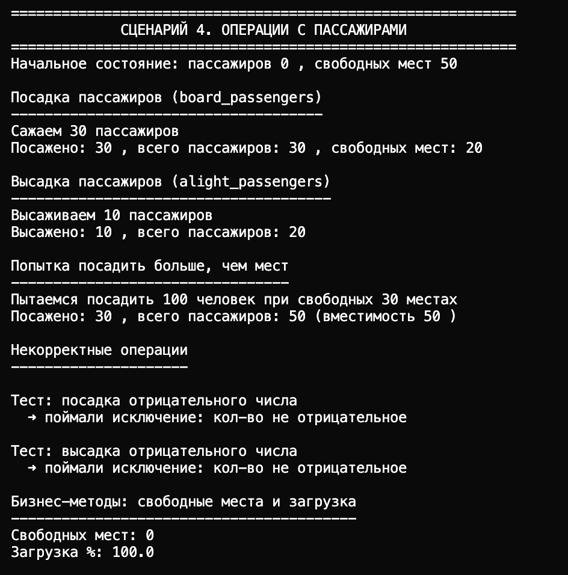
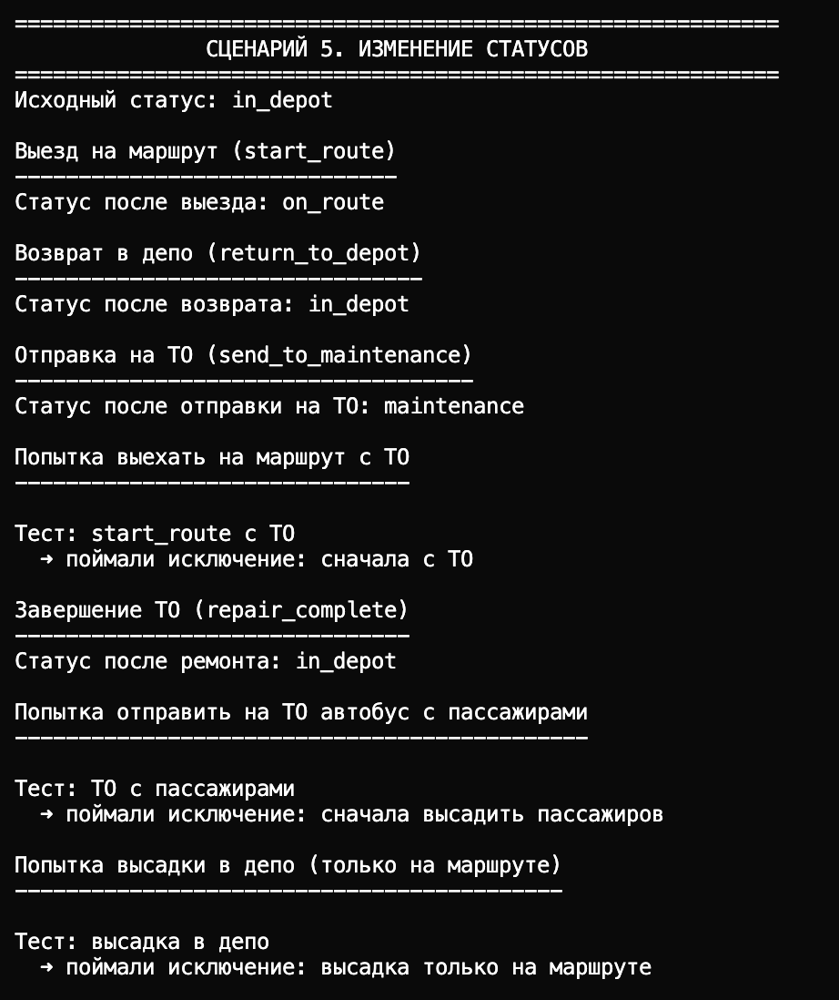
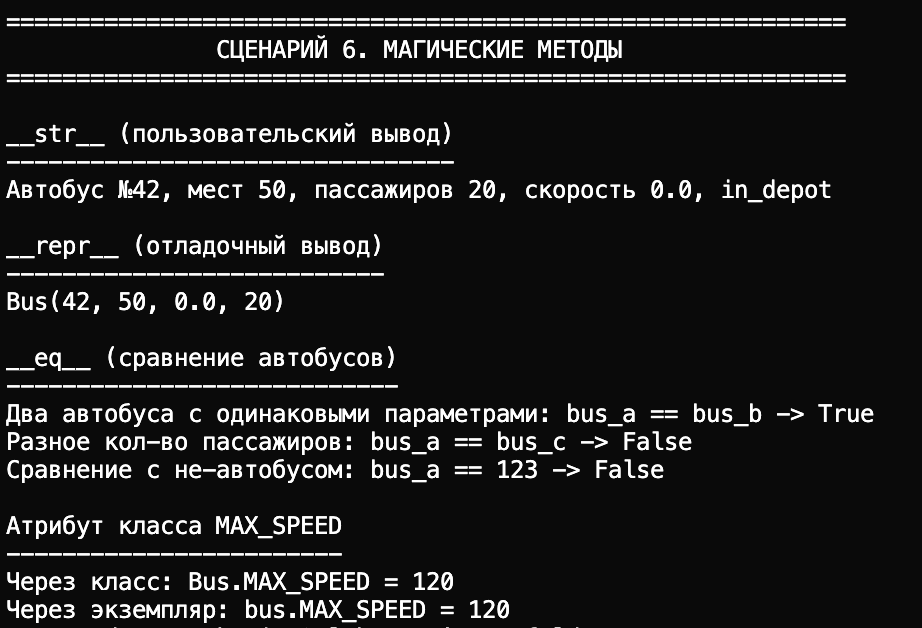

# «Умный» автобус на маршруте, который:

- Сам следит за корректностью данных (валидация номера маршрута, вместимости, скорости, пассажиров)
- Запрещает недопустимые операции (скорость в депо, посадка на ТО, высадка не на маршруте, отправка на ТО с пассажирами)
- Предоставляет удобный интерфейс через свойства (@property)

# Реализованный класс Bus

**Закрытые поля:**

- `_route_number` — номер маршрута
- `_capacity` — вместимость 
- `_current_speed` — текущая скорость
- `_passenger_count` — количество пассажиров
- `_state` — статус: `in_depot` / `on_route` / `maintenance`

**Свойства @property:**

- Чтение: `route_number` — номер маршрута
- Чтение: `capacity` — вместимость
- Чтение: `passenger_count` — количество пассажиров
- Чтение: `state` — статус автобуса
- Чтение и запись: `current_speed` — скорость (с проверкой состояния и диапазона)

**Методы:**

- `__str__` — print (читаемое описание)
- `__repr__` — для умных
- `__eq__` — сравнение

**Методы изменения состояния:**

- `start_route()` — выехать на маршрут
- `return_to_depot()` — вернуться в депо
- `send_to_maintenance()` — отправить на Тех. О
- `repair_complete()` — завершить Тех. О

**Бизнес-методы:**

- `board_passengers(count)` — посадить пассажиров (с учётом вместимости и статуса)
- `alight_passengers(count)` — высадить пассажиров (только на маршруте)
- `free_seats()` — количество свободных мест
- `load_factor()` — загрузка в процентах

---

### Создание автобуса 

- Создание автобуса с номером маршрута и вместимостью
- Вывод через `print(bus)` — читаемое описание (номер, места, пассажиры, скорость, состояние)
- Вывод через `repr(bus)` — компактное представление для отладки

Показывает, что объект создаётся с проверкой данных и выводится через методы

### Ошибки 

- Некорректный тип номера маршрута (строка вместо числа)
- Номер маршрута вне диапазона (0)
- Пассажиров больше вместимости

### Сравнение 

- Сравнение двух автобусов с одинаковыми параметрами — `True`
- Сравнение с разным числом пассажиров — `False`
- Демонстрируется работа `__eq__`

### Операции с пассажирами 

### Свойства (геттер/сеттер)

- Установка скорости на маршруте — успешно
- Попытка установить скорость выше `MAX_SPEED` — ошибка
- В депо попытка изменить скорость — ошибка («в депо скорость 0»)

Демонстрируется работа свойства `current_speed` с валидацией и учётом состояния

### Посадка и ограничения по вместимости

- Посадка 30 пассажиров — успешно
- Попытка посадить 100 при вместимости 50 — садятся только до заполнения

Показать, что бизнес-метод `board_passengers` ограничивает число по пассажирам и не даёт превысить вместимость

### Изменение состояний

- Начальное состояние — в депо
- `start_route()` — на маршруте
- Установка скорости, высадка пассажиров, возврат в депо
- `send_to_maintenance()` — на ТО
- Попытка `start_route()` с ТО — ошибка
- `repair_complete()` — снова в депо

Прослеживается смена состояний и запрет недопустимых переходов

### Ограничения по состоянию

- Высадка в депо — ошибка (высадка только на маршруте)
- Отправка на ТО с пассажирами — ошибка (сначала высадить)

Показать, что операции зависят от текущего статуса автобуса

### Расчётные бизнес-методы

- `free_seats()` — количество свободных мест
- `load_factor()` — загрузка в процентах

Демонстрация расчётных методов по данным автобуса.

---
