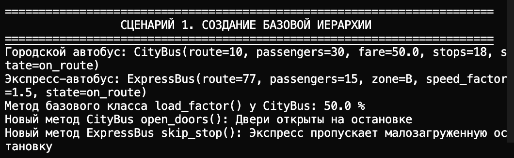
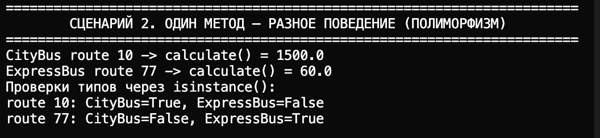
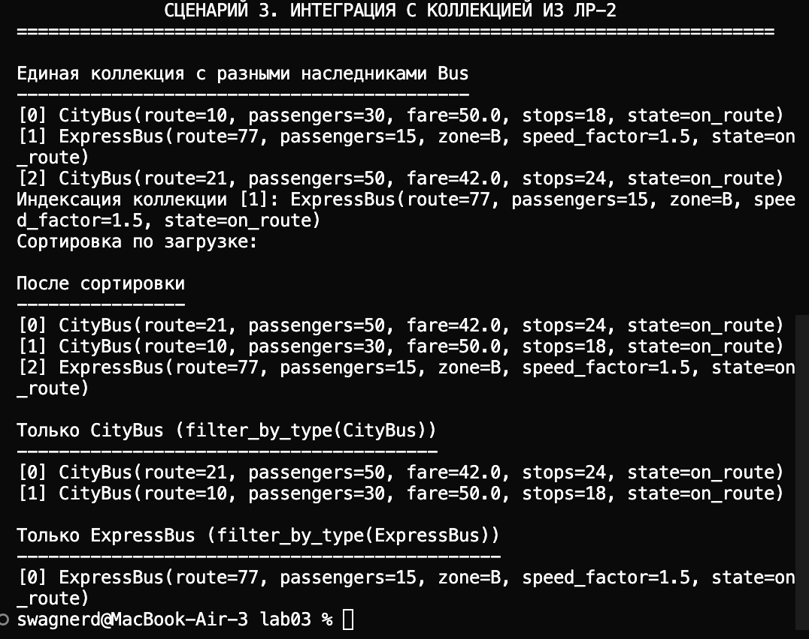

# ЛР-3 — Наследование и иерархия классов

## 1. Цель работы

- Освоить наследование классов в Python
- Построить иерархию объектов на базе кода ЛР-1
- Понять разницу между базовым и производными классами
- Показать полиморфизм и переопределение методов
- Интегрировать иерархию с коллекцией из ЛР-2

## 2. Реализованная иерархия классов

Базовый класс:
- `BusBase` (наследуется от `Bus` из ЛР-1 и вводит общий интерфейс `calculate()`)

Дочерние классы:
- `CityBus`
  - новые атрибуты: `fare`, `stop_count`
  - новый метод: `open_doors()`
  - полиморфный метод: `calculate()` (выручка за рейс)
  - переопределение: `__str__`
- `ExpressBus`
  - новые атрибуты: `zone`, `speed_factor`
  - новый метод: `skip_stop()`
  - полиморфный метод: `calculate()` (рекомендуемая скорость)
  - переопределение: `__str__`

## 3. Демонстрация работы

В `demo.py` реализованы 3 сценария:

1. Создание объектов разных типов (`CityBus`, `ExpressBus`), вызов методов базового и дочерних классов
2. Полиморфизм: вызов одного метода `calculate()` у разных объектов с разным результатом, проверка типов через `isinstance()`
3. Интеграция с `BusCollection` (ЛР-2): единая коллекция разных наследников, индексация, сортировка, фильтрация по типу через `filter_by_type(...)` 

Скриншоты запуска `demo.py` размещаются в `images/lab03/` (при необходимости добавьте файлы вручную)

## 4. Вывод

В ЛР-3 закреплены:
- наследование и переиспользование кода;
- переопределение методов;
- полиморфизм без `if type == ...` (единый вызов `obj.calculate()`);
- работа иерархии классов через общий контейнер
# Создание базовой иерархии 

# Один метод - разное поведение (полиформизм)

# Интеграция с колекцией из ЛР-2 
