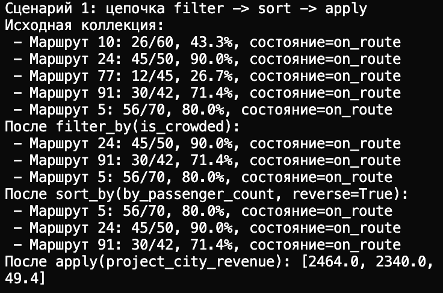
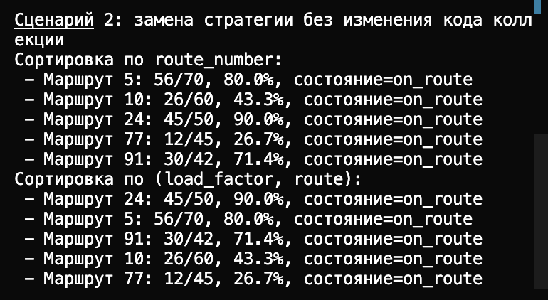
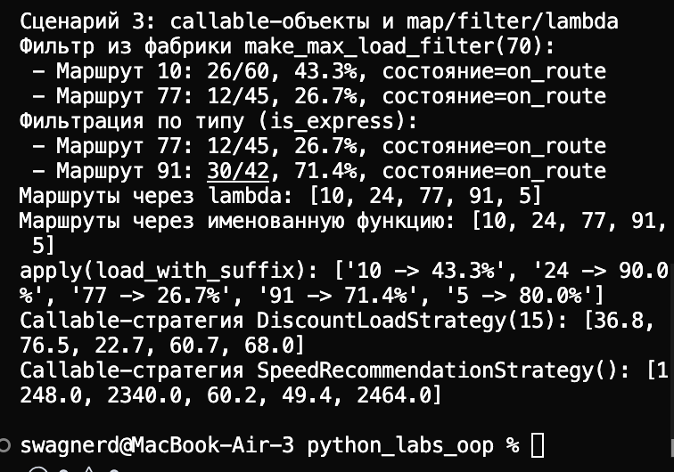

# ЛР-5 — Функции как аргументы. Стратегии и делегаты

## 1. Цель работы

- Освоить передачу функций как аргументов в методы и функции.
- На практике применить `map`, `filter`, `sorted` и `lambda`.
- Реализовать паттерн «Стратегия» через взаимозаменяемые функции и callable-объекты.
- Интегрировать функциональный стиль с иерархией автобусов и коллекцией из предыдущих лабораторных.

## 2. Реализованные функции и стратегии

Файлы:
- `collection.py` — коллекция `FunctionalBusCollection` с методами `sort_by`, `filter_by`, `apply`.
- `strategies.py` — все функции-стратегии, фильтры, фабрики и callable-объекты.
- `demo.py` — демонстрация сценариев.

### Функции-стратегии сортировки

- `by_route_number(item)` — сортировка по номеру маршрута.
- `by_passenger_count(item)` — сортировка по числу пассажиров.
- `by_load_and_route(item)` — сортировка по двум атрибутам: загрузка и номер маршрута.

Сортировка используется через `sorted(..., key=...)` внутри `sort_by` и через передачу `lambda`/именованных функций.

### Функции-фильтры

- `is_crowded(item)` — отбор автобусов с загрузкой от 60%.
- `is_express(item)` — отбор объектов типа `ExpressBus`.
- `make_max_load_filter(max_load)` — фабрика функций, создаёт предикат с параметром.

### Функции высшего порядка и преобразования

- `filter()` применяется в `FunctionalBusCollection.filter_by(...)`.
- `map()` применяется в `FunctionalBusCollection.apply(...)` и в `demo.py` для извлечения маршрутов.
- `lambda` показана в сравнении с именованной функцией:
  - `list(map(lambda item: item.route_number, collection))`
  - `list(map(by_route_number, collection))`

### Паттерн «Стратегия» через callable-объекты

- `DiscountLoadStrategy(discount_percent)` — callable-объект, который пересчитывает условную загрузку.
- `SpeedRecommendationStrategy()` — callable-объект, который возвращает расчётное значение из `calculate()`.

## 3. Демонстрация работы

В `demo.py` реализованы 3 сценария:

1. **Цепочка операций**  
   Полная последовательность `filter -> sort -> apply` с выводом результата после каждого шага.

2. **Замена стратегии без изменения коллекции**  
   Один и тот же набор данных сортируется разными стратегиями (`by_route_number` и `by_load_and_route`), меняется только переданная функция.

3. **Callable-стратегии + map/filter/lambda**  
   Показаны:
   - фильтрация функцией из фабрики (`make_max_load_filter`);
   - фильтрация по типу (`is_express`);
   - сравнение `lambda` и именованной функции;
   - применение callable-объектов через `apply(...)`

## 
## 
## 
