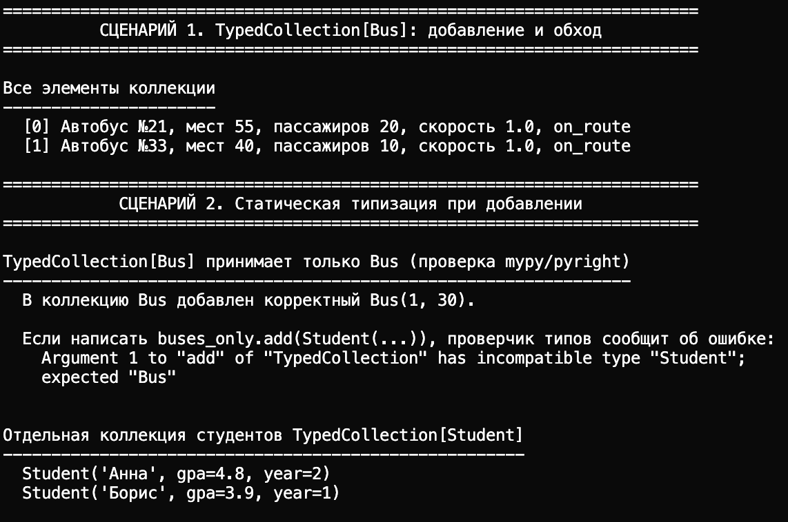
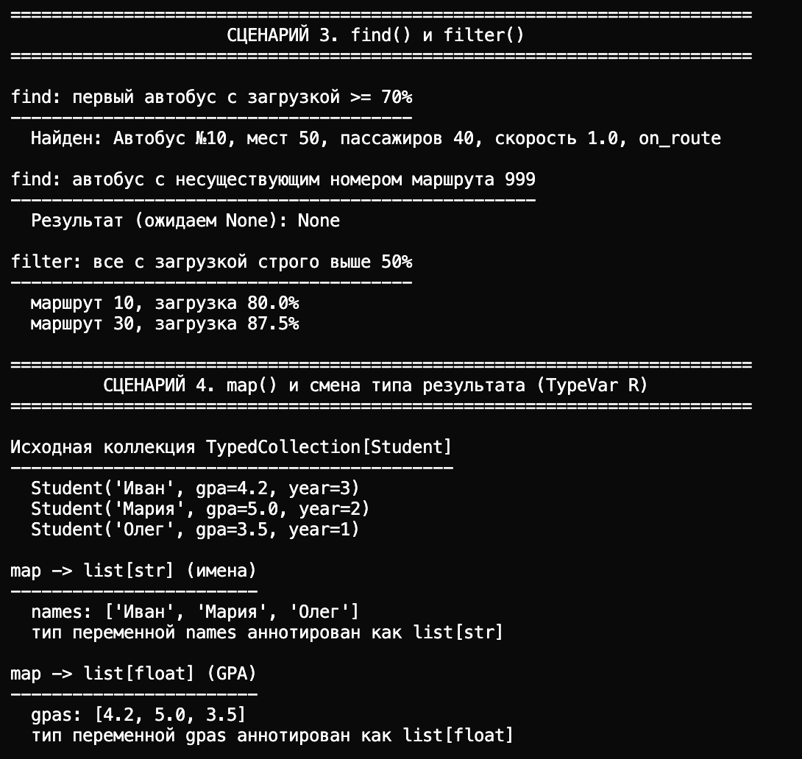
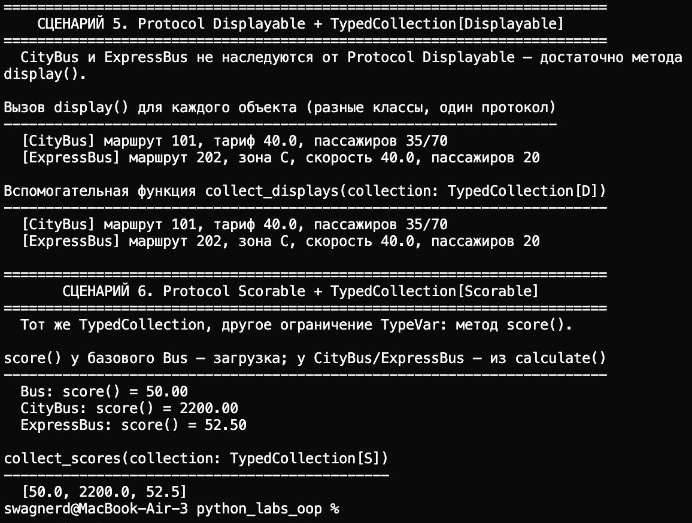

# ЛР-6 — Generics и typing

## 1. Цель работы

- Освоить аннотации типов в Python (`typing`) и их роль при чтении и сопровождении кода.
- Научиться объявлять обобщённые классы через `TypeVar` и `Generic`.
- Понять структурную типизацию на примере `typing.Protocol`.
- Связать типизацию с уже реализованными классами ЛР-1 и иерархией ЛР-3.

## 2. Описание реализованных типов и контейнеров

### Аннотации в ЛР-1 и ЛР-3

В `src/lab01/model.py`, `src/lab01/validate.py`, `src/lab03/base.py`, `src/lab03/models.py` добавлены аннотации:

- параметры конструкторов и методов;
- возвращаемые типы;
- типы атрибутов, задаваемых в `__init__`.

Для протоколов ЛР-6 (без наследования от `Protocol`) в класс `Bus` и наследников иерархии добавлены методы:

- `display() -> str` — краткое текстовое представление для сценария `Displayable`;
- `score() -> float` — числовой показатель: у `Bus` это загрузка в процентах, у `CityBus` / `ExpressBus` — результат `calculate()`.

Классы **не** наследуются от `Displayable` / `Scorable`: соответствие протоколу структурное (наличие методов с нужными сигнатурами).

### Generic: `TypedCollection` (`container.py`)

`TypedCollection` — обобщённая версия коллекции из ЛР-2 (`BusCollection`): тот же набор методов плюс `find`, `filter`, `map` из задания на оценку 4.

**TypeVar `T`** — тип элементов коллекции (произвольный, без ограничения).

**TypeVar `R`** — тип результата в методе `map` (может отличаться от `T`).

**TypeVar `D`, bound=`[`Displayable`]`** — элементы, у которых статически известно наличие `display()`.

**TypeVar `S`, bound=`[`Scorable`]`** — элементы с методом `score()`.

Протоколы:

- `Displayable` — контракт `display(self) -> str`;
- `Scorable` — контракт `score(self) -> float`.

Вспомогательные функции `collect_displays` и `collect_scores` принимают `TypedCollection[D]` и `TypedCollection[S]` и показывают, что внутри можно безопасно вызывать `display()` и `score()`.

Коллекция из ЛР-2 (`src/lab02/collection.py`) **не изменялась**.

### Файлы

| Файл | Назначение |
|------|------------|
| `container.py` | `TypedCollection`, протоколы, `TypeVar`, функции с bound |
| `demo.py` | Сценарии демонстрации |

## 3. Демонстрация работы

В `demo.py` реализованы сценарии:

1. **TypedCollection[Bus]** — создание, `add`, обход `get_all()`.
2. **Статическая типизация** — пояснение, что `TypedCollection[Bus]` и `TypedCollection[Student]` разделяют тип элементов; отдельная коллекция студентов.
3. **`find`** — один успешный поиск и один с результатом `None`.
4. **`filter`** — список элементов по предикату.
5. **`map`** — два вызова с разными функциями: `list[str]` (имена) и `list[float]` (GPA) из одной `TypedCollection[Student]`.
6. **`TypedCollection[Displayable]`** — `CityBus` и `ExpressBus` без наследования от протокола; вызов `display()` и `collect_displays`.
7. **`TypedCollection[Scorable]`** — те же идеи для `score()`; показано, что одна реализация `TypedCollection` работает с разными ограничениями `TypeVar`.

Скриншоты вывода терминала (по одному на сценарий или группу):

## 
## 
## 

*(Добавьте файлы изображений в каталог `img/lab06/` после запуска `demo.py`.)*

## 4. Вывод

Были закреплены:

- роль аннотаций типов в документировании контрактов и поддержке IDE;
- обобщённые классы `Generic[T]` и смена типа результата через второй `TypeVar` (`map`);
- `Protocol` как структурный интерфейс без обязательного наследования;
- ограничения `TypeVar` через `bound=` для безопасных вызовов методов протокола внутри обобщённого кода.
