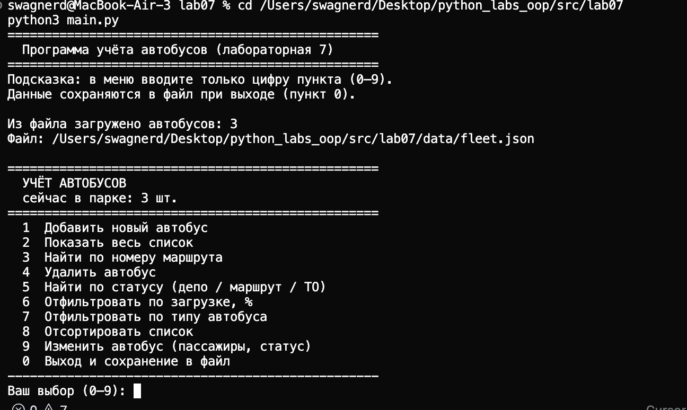
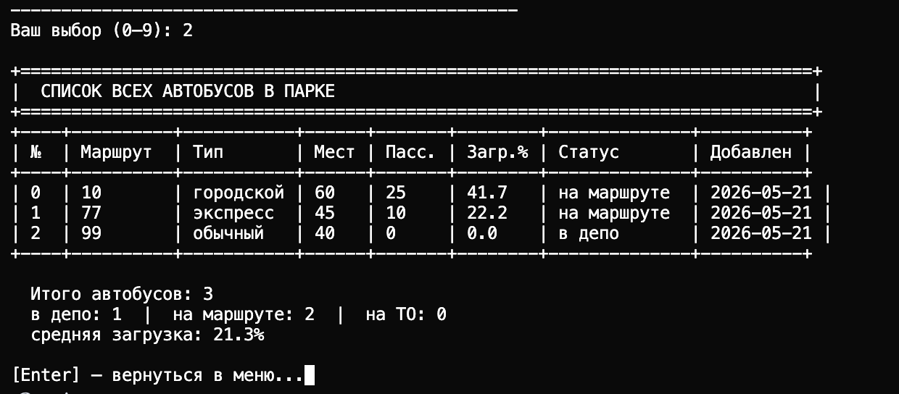
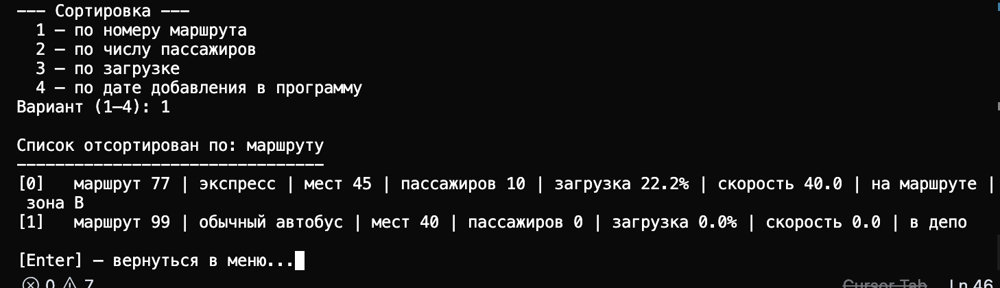
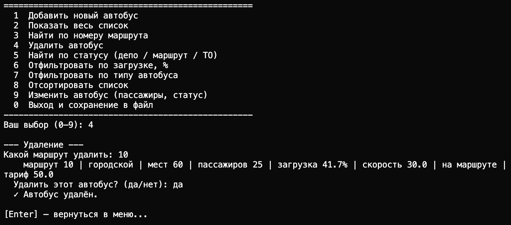

# ЛР-7 — консольное приложение

## Цель

Собрать в одну программу то, что делал в лр 1–6: автобусы, коллекция, фильтры и сортировка из лр 5, типизированная коллекция из лр 6

## Файлы

- `main.py` — запуск, загрузка и сохранение json
- `cli.py` — меню и ввод (без логики коллекции)
- `app.py` — класс `BusPark`, все операции с автобусами
- `exceptions.py` — `ItemNotFoundError`, `DuplicateItemError`
- `storage.py` — запись/чтение `data/fleet.json`

## Меню

1. добавить (bus / city / express)  
2. показать все  
3. найти по маршруту  
4. удалить (с подтверждением y/n)  
5. поиск по статусу  
6. фильтр по загрузке  
7. фильтр по типу  
8. сортировка (маршрут, пассажиры, загрузка, дата)  
9. посадка / статус и т.д.  
0. выход — сохранение в файл  

При старте данные подгружаются из `data/fleet.json`

## Скрины
### Интерфейс 

### Список

### Удаление басика 

## Вывод

Разделил код на слои (cli / app / storage), сделал цикл меню, свои исключения, сохранение в json
